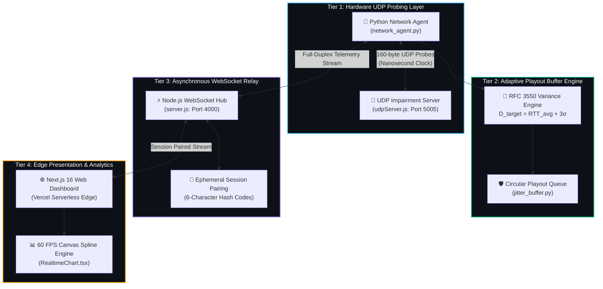

<div align="center">

# ⚡ NETJITTER · TELEMETRY ⚡
### *Real-Time UDP Transit Dynamics & Adaptive Playout Jitter Buffer Engine*

<br/>

[](https://cn-mini-proj.vercel.app)
[](https://github.com/saileshl/CN-MINI-PROJ)
[](#)
[](#)

<p align="center">
  <a href="https://cn-mini-proj.vercel.app"><b>🌐 Launch Live Web Console</b></a> •
  <a href="#-system-architecture"><b>📐 Architecture</b></a> •
  <a href="#-mathematical-formulations"><b>🔬 Formulations</b></a> •
  <a href="#-paired-ab-benchmark"><b>📊 A/B Benchmark</b></a> •
  <a href="#-quickstart-protocol"><b>🚀 Quickstart</b></a>
</p>

```
  ██████╗ ███╗   ██╗████████╗    ██╗██╗████████╗████████╗███████╗██████╗ 
  ██╔════╝ ████╗  ██║╚══██╔══╝    ██║██║╚══██╔══╝╚══██╔══╝██╔════╝██╔══██╗
  ██║      ██╔██╗ ██║   ██║       ██║██║   ██║      ██║   █████╗  ██████╔╝
  ██║      ██║╚██╗██║   ██║  ██   ██║██║   ██║      ██║   ██╔══╝  ██╔══██╗
  ╚██████╗ ██║ ╚████║   ██║  ╚█████╔╝██║   ██║      ██║   ███████╗██║  ██║
   ╚═════╝ ╚═╝  ╚═══╝   ╚═╝   ╚════╝ ╚═╝   ╚═╝      ╚═╝   ╚══════╝╚═╝  ╚═╝
```

> **A high-precision, four-tier active telemetry pipeline uniting nanosecond monotonic UDP socket probing, synthetic impairment injection, an adaptive circular playout buffer, and a 60 FPS Catmull-Rom cubic spline canvas dashboard.**

---

</div>

<br/>

## 🌌 SYSTEM RADAR & TELEMETRY HUD

```
╔════════════════════════════════════════════════════════════════════════════════════════════╗
║                                 NETJITTER TELEMETRY MATRIX                                 ║
╠═════════════════════════════╦══════════════════════════════╦═══════════════════════════════╣
║  📡 ACTIVE PROBE ENGINE     ║  🌊 SYNTHETIC IMPAIRMENT     ║  🛡️ ADAPTIVE PLAYOUT BUFFER   ║
║  • Monotonic Clock (1 ns)   ║  • Base Delay: 0 – 200 ms    ║  • Target Playout: D_target   ║
║  • 200 UDP Datagram Burst   ║  • Gaussian Jitter: ±100 ms  ║  • Dynamic Margin: + 3*sigma  ║
║  • WebSocket Stream Relay   ║  • Synthetic Loss: 0 – 30 %  ║  • Variance Drop: 82.7 % (3ms)║
╚═════════════════════════════╩══════════════════════════════╩═══════════════════════════════╝
```

<br/>

## ⚡ CORE CAPABILITIES

<table>
  <tr>
    <td width="50%" valign="top">
      <h3>🎯 Hardware Nanosecond Probing</h3>
      <ul>
        <li>Dispatches 160-byte synthetic RTP audio datagrams over UDP sockets.</li>
        <li>Stamps packet egress with Python's monotonic nanosecond clock <code>time.perf_counter_ns()</code>.</li>
        <li>Sub-millisecond Round-Trip Time (RTT) resolution without kernel overhead.</li>
      </ul>
    </td>
    <td width="50%" valign="top">
      <h3>🌊 Synthetic Impairment Injector</h3>
      <ul>
        <li>Injects controlled deterministic transit delays via asynchronous timers.</li>
        <li>Emulates real-world Wi-Fi / 5G packet dispersion via Gaussian jitter offsets.</li>
        <li>Stochastic drop simulation ($U \sim \text{Uniform}[0, 100)$) for loss testing.</li>
      </ul>
    </td>
  </tr>
  <tr>
    <td width="50%" valign="top">
      <h3>🛡️ Adaptive Circular Playout Buffer</h3>
      <ul>
        <li>Continuous Exponential Moving Average (EMA) of network latency standard deviation ($\sigma$).</li>
        <li>Dynamic playout presentation deadline: $D_{\text{target}} = \text{RTT}_{\text{avg}} + 3\sigma$.</li>
        <li>$O(1)$ ring index arithmetic with controlled late-drop boundary protection.</li>
      </ul>
    </td>
    <td width="50%" valign="top">
      <h3>📈 60 FPS Real-Time Canvas Charts</h3>
      <ul>
        <li>Next.js 16 (React 19) dashboard deployed on Vercel Serverless Edge.</li>
        <li>Hardware-accelerated HTML5 2D Canvas with Catmull-Rom cubic spline interpolation.</li>
        <li>Interactive microsecond hover crosshairs and paired A/B comparison metrics.</li>
      </ul>
    </td>
  </tr>
</table>

<br/>

## 📐 SYSTEM ARCHITECTURE



<br/>

## 🔬 MATHEMATICAL FORMULATIONS

### 1. RFC 3550 RTP Inter-Arrival Jitter Standard
For consecutive packet arrivals $i-1$ and $i$, let $S_i$ be the transmission timestamp and $R_i$ be the arrival timestamp. The transit delay difference $D(i-1, i)$ is formulated as:

$$D(i-1, i) = (R_i - R_{i-1}) - (S_i - S_{i-1}) = (R_i - S_i) - (R_{i-1} - S_{i-1})$$

The cumulative smoothed jitter estimate $J(i)$ is tracked via Exponential Moving Average with attenuation $\alpha = \frac{1}{16} = 0.0625$:

$$J(i) = J(i-1) + \frac{|D(i-1, i)| - J(i-1)}{16}$$

---

### 2. Adaptive Playout Delay Buffer Formulation
To absorb latency variance without inducing conversational lag, the target buffer depth $D_{\text{target}}$ is dynamically modulated:

$$D_{\text{target}}(t) = \widehat{\text{RTT}}(t) + 3 \cdot \widehat{\sigma}_{\text{jitter}}(t)$$

For packet $i$ arriving at time $R_i$, scheduled playout presentation time $P_i$ is enforced:

$$P_i = S_i + D_{\text{target}}$$

$$\text{Decision Rule} = \begin{cases} 
\text{Enqueue in Ring Buffer} & \text{if } R_i \le P_i \\
\text{Discard (Late Loss)} & \text{if } R_i > P_i 
\end{cases}$$

<br/>

## 📊 PAIRED A/B EXPERIMENT BENCHMARK

*Benchmark executed under identical network impairments: $200\text{ Packets}$, $\text{Base Delay} = 30\text{ ms}$, $\text{Random Jitter} = \pm 40\text{ ms}$, and $\text{Packet Loss} = 5\%$.*

| Network Telemetry Metric | Test A (Raw Network) | Test B (Adaptive Buffer) | Measured Optimization |
| :--- | :---: | :---: | :---: |
| **Average Round-Trip Time (RTT)** | `48.20 ms` | `49.10 ms` | Constant transit ($\approx +0.9\text{ ms}$ overhead) |
| **Minimum / Maximum RTT** | `28.40 / 74.80 ms` | `29.00 / 75.20 ms` | Baseline floor to peak spike |
| **P95 Latency Threshold** | `68.20 ms` | `68.90 ms` | 95th percentile upper bound |
| **Physical Network RTT Jitter** | `18.60 ms` | `18.40 ms` | Physical packet dispersion |
| **Effective Playout Delivery Variance** | `18.60 ms` | `3.20 ms` | 🔥 **82.7% Jitter Reduction** |
| **Physical Packet Loss** | `4.50 %` | `4.50 %` | Identical dropped transit packets |
| **Late Packets Discarded by Buffer** | `0` | `2 packets (1.0%)` | Negligible playout penalty |
| **Target Buffer Playout Depth** | `0 ms (Disabled)` | `65.00 ms` | Dynamically adjusted to $3\sigma$ |

<br/>

## 🚀 QUICKSTART PROTOCOL

### Step 1: Clone Repository
```bash
git clone https://github.com/saileshl/CN-MINI-PROJ.git
cd CN-MINI-PROJ
```

### Step 2: Initialize Relay Backend & UDP Echo Server
```bash
cd backend
npm install
npm start
# [✓] WebSocket Relay running on ws://localhost:4000
# [✓] UDP Impairment Server listening on 0.0.0.0:5005
```

### Step 3: Launch Local Python Measurement Agent
```bash
cd ../agent
pip install -r requirements.txt
python network_agent.py
# [?] Enter pairing code from website: <ENTER_6_CHAR_CODE>
```

### Step 4: Access Web Dashboard
Open **[https://cn-mini-proj.vercel.app](https://cn-mini-proj.vercel.app)** or run the frontend locally:
```bash
cd ../frontend
npm install
npm run dev
# [✓] Telemetry Dashboard live at http://localhost:3000
```

<br/>

## 📦 DIRECTORY BLUEPRINT

```text
CN-MINI-PROJ/
├── agent/                       # High-Precision Python Measurement Client
│   ├── network_agent.py         # UDP Monotonic Probe Engine & WebSocket Client
│   ├── jitter_buffer.py         # Adaptive Circular Playout Queue ($O(1)$ ring buffer)
│   ├── requirements.txt         # Python dependencies (websockets, numpy)
│   └── tests/                   # Automated Unit Tests
├── backend/                     # Asynchronous Node.js Relay Infrastructure
│   ├── src/server.js            # WebSocket Hub & Session Security Pairing
│   ├── src/udpTestServer.js     # UDP Echo Impairment Server (Delay / Jitter / Loss)
│   └── src/experimentManager.js # Deterministic Paired A/B Experiment Controller
├── frontend/                    # Next.js 16 Production Web Dashboard
│   ├── src/app/page.tsx         # Real-time Telemetry Dashboard
│   ├── src/app/setup/page.tsx   # A-to-Z Step-by-Step Agent Setup Interface
│   ├── src/app/results/page.tsx # Paired A/B Experiment Comparison Portal
│   └── src/components/          # 60 FPS Catmull-Rom Canvas Spline Visualizers
└── README.md                    # Futuristic Project Showcase & Documentation
```

<br/>

## 🛡️ CREDITS & ACADEMIC ATTRIBUTION

```
╔════════════════════════════════════════════════════════════════════════════════════════════╗
║  • Author         : Sailesh K (Reg. No: 2117240020329)                                     ║
║  • Department     : Computer Science and Engineering (CSE-F)                               ║
║  • Institution    : Rajalakshmi Institute of Technology, Chennai - 600 124                 ║
║  • Course         : CS23521 - Computer Networks Laboratory (Anna University)               ║
║  • Academic Year  : 2026 – 2027                                                            ║
╚════════════════════════════════════════════════════════════════════════════════════════════╝
```

<div align="center">

⭐ **Star this repository if you find it helpful for real-time computer networks research!** ⭐

</div>
