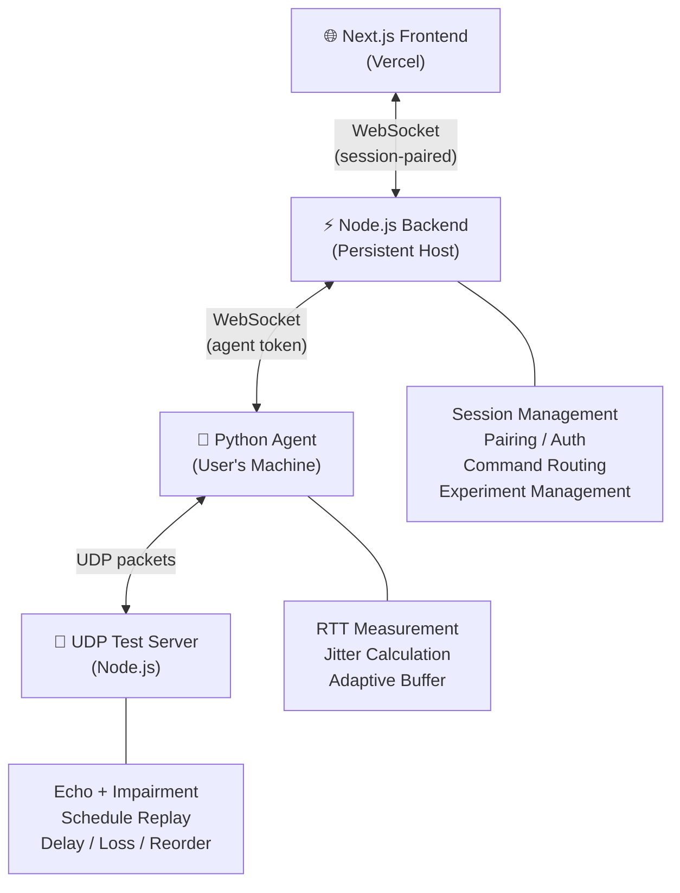

# Network Jitter Measurement & Reduction System

A full-stack system that measures real network jitter via UDP packets and demonstrates **application-level** adaptive jitter buffer mitigation, with live results streaming to a polished web dashboard.

## Demo

1. Open the web dashboard → Setup page
2. Get a pairing code, download and run the Python Agent
3. Agent auto-connects to the backend
4. Click **Start Test** → watch live RTT and jitter charts
5. Configure network impairment (delay, jitter, loss) on the UDP test server
6. Enable the adaptive jitter buffer → see effective delivery variation decrease
7. Run a **Paired Experiment** → identical impairment, side-by-side before/after comparison

## Features

- ⚡ **Real UDP measurement** — actual round-trip packet timing, not simulated
- 📊 **Live streaming dashboard** — RTT, RTT Variation, packet loss in real-time
- 🔬 **Paired A/B experiments** — same deterministic impairment schedule for fair comparison
- 🛡️ **Adaptive jitter buffer** — application-level mitigation with honest reporting
- 🔗 **Per-session pairing** — pair once, auto-connect forever
- 🌊 **Configurable impairment** — base delay, random jitter, packet loss, reordering
- 📱 **Multi-user isolation** — each session is independent
- 💾 **Client-local results** — saved in localStorage, exportable as JSON

## Architecture



| Component | Tech | Deployment |
|-----------|------|------------|
| Frontend | Next.js 14+, React, CSS | Vercel |
| Backend | Node.js, Express, ws | Persistent host (Railway/Render/VPS) |
| UDP Server | Node.js dgram | Same host as backend |
| Python Agent | Python 3.10+, websockets | User's local machine |

## How It Works

```
Browser → WebSocket → Backend → WebSocket → Python Agent → UDP → Test Server
```

1. **Browser** opens dashboard, creates a session via REST API
2. **Backend** generates a pairing code for the session
3. **Python Agent** starts on user's machine, enters pairing code (first time only)
4. **Backend** validates code, issues persistent `agent_token` → agent stores it locally
5. **Agent** sends UDP packets to the test server, measures round-trip time
6. **Agent** calculates RTT variation (jitter metric) and streams results to backend
7. **Backend** relays data to dashboard via WebSocket
8. **Dashboard** renders live charts and metrics

### Why a Local Python Agent?

Browsers cannot send raw UDP packets. The Python Agent runs on your machine to perform real network measurements that a browser simply cannot do. It communicates with the backend via WebSocket to relay results to the dashboard.

## Jitter Measurement

**Our primary jitter metric is RTT Variation:**

```
For consecutive packets i and i-1:
    variation_i = abs(RTT_i - RTT_{i-1})

Average RTT Variation = mean(variation_1, ..., variation_n)
```

This is **NOT** RFC 3550 RTP interarrival jitter. RFC 3550 defines one-way interarrival jitter for RTP streams. Our system measures round-trip UDP echo times — the RTT variation metric is the honest, correct measurement for our architecture.

### Additional Metrics
- Average / Min / Max RTT
- RTT Standard Deviation
- RTT Percentiles (P50, P95, P99)
- Packet Loss Percentage

## Jitter Mitigation

The adaptive jitter buffer provides **application-level** mitigation of jitter effects.

### What It Does
- Buffers incoming packets
- Releases them on a controlled playout schedule
- Smooths variable arrival times for the application layer
- Dynamically adjusts buffer depth using EWMA of arrival variation

### What It Does NOT Do
- ❌ Reduce ISP jitter
- ❌ Reduce Wi-Fi interference
- ❌ Reduce router queueing delay
- ❌ Change the physical network path

### Metrics When Buffer Is Active
Both raw and effective metrics are displayed:
- **Raw RTT / RTT Variation** → unchanged, always visible
- **Effective Delivery Variation** → variation after buffer smoothing (should be lower)
- **Buffer Depth** → current adaptive depth
- **Late / Dropped Packets** → packets that arrived past their playout deadline

## Controlled Impairment

Impairment is applied by the **UDP Test Server**, not the Python Agent:

| Parameter | Description | Example |
|-----------|-------------|---------|
| Base Delay | Fixed minimum response delay | 30 ms |
| Random Jitter | Uniform random ± delay | ±40 ms |
| Packet Loss | Probability of dropping response | 5% |
| Reordering | Extra delay causing packet reorder | 0% |

For paired experiments, the server uses **deterministic schedule replay** — same seed produces identical per-packet impairment for Test A and Test B.

## Requirements

- **Node.js** 18+ (backend + UDP server)
- **Python** 3.10+ (agent)
- **npm** 9+ (package management)

## Installation

```bash
# Clone the repository
git clone https://github.com/saileshl/CN-MINI-PROJ.git
cd CN-MINI-PROJ

# Backend
cd backend
npm install
cp ../.env.example .env

# Frontend
cd ../frontend
npm install

# Python Agent
cd ../agent
pip install -r requirements.txt
cp config.example.json config.json
```

## Running Locally

### ⚡ Option A: Single Command Quick Start (Recommended)

From the project root (`CN-MINI-PROJ`), run:
```bash
npm start
```
*Or on Windows, simply double-click:* **`start.bat`**

This starts both the **Node.js Backend (port 4000 + UDP 5005)** and the **Next.js Frontend (port 3000)** simultaneously with unified output!

Then in a second terminal, run your Python agent:
```bash
cd agent
python network_agent.py
```

---

### 🛠️ Option B: Running Services Separately

**Terminal 1 — Backend + UDP Server:**
```bash
cd backend
npm start
```
Output:
```
[HTTP] Server listening on port 4000
[WS]   Agent endpoint:     ws://localhost:4000/ws/agent
[WS]   Dashboard endpoint: ws://localhost:4000/ws/dashboard
[UDP]  Test server on port 5005
```

**Terminal 2 — Frontend:**
```bash
cd frontend
npm run dev
```
Open: http://localhost:3000

**Terminal 3 — Python Agent:**
```bash
cd agent

# First time (get code from http://localhost:3000/setup):
python network_agent.py --code A7X2K9

# After pairing (auto-connects):
python network_agent.py
```

## Agent Setup

### First-Time Pairing (Once)
1. Open http://localhost:3000/setup
2. Note the 6-character pairing code
3. Run: `python network_agent.py --code YOUR_CODE`
4. Agent connects, stores credential at `~/.networkjitter/credentials.json`

### Normal Startup (Every Time After)
```bash
python network_agent.py
```
No code, no configuration, no manual steps.

### Reset / Re-pair
```bash
python network_agent.py --reset
```

## Website Usage

1. **Dashboard** (`/`) — Start tests, view live charts, configure impairment, toggle mitigation, run paired experiments
2. **Setup** (`/setup`) — Pair your agent, troubleshooting, download links
3. **Results** (`/results`) — View saved experiment comparisons, export JSON

## Testing

```bash
# Backend tests (21 tests: pairing, tokens, isolation, experiments)
cd backend && npm test

# Python agent tests (32 tests: RTT calc, buffer behavior, controlled experiment)
cd agent && python -m pytest tests/ -v

# Frontend build check
cd frontend && npm run build
```

## Production Deployment

### Frontend → Vercel

1. Push repository to GitHub
2. Import project in Vercel
3. Set root directory to `frontend`
4. Add environment variables:
   - `NEXT_PUBLIC_BACKEND_URL` = `https://your-backend.railway.app`
   - `NEXT_PUBLIC_WS_URL` = `wss://your-backend.railway.app`
5. Deploy

### Backend → Persistent WebSocket Host

**Railway / Render / VPS:**

1. Deploy the `backend/` directory
2. Set environment variables:
   - `PORT` = `4000` (or provider's PORT)
   - `UDP_PORT` = `5005`
   - `CORS_ORIGIN` = `https://your-frontend.vercel.app`
3. Ensure WebSocket connections are supported (not serverless)

### Python Agent

**Source:**
```bash
pip install -r requirements.txt
python network_agent.py --code YOUR_CODE
```

**Windows Executable (via GitHub Releases):**
1. Download `NetworkJitterAgent.exe` from the Releases page
2. Run: `NetworkJitterAgent.exe --code YOUR_CODE`

**Building the executable:**
```bash
cd agent
.\build_agent.bat    # Windows CMD
.\build_agent.ps1    # PowerShell
```

## Environment Variables

| Variable | Where | Description | Default |
|----------|-------|-------------|---------|
| `PORT` | Backend | HTTP/WS server port | `4000` |
| `UDP_PORT` | Backend | UDP test server port | `5005` |
| `CORS_ORIGIN` | Backend | Allowed frontend origin | `http://localhost:3000` |
| `PAIRING_CODE_EXPIRY_MS` | Backend | Pairing code TTL | `300000` (5 min) |
| `NEXT_PUBLIC_BACKEND_URL` | Frontend | Backend HTTP URL | `http://localhost:4000` |
| `NEXT_PUBLIC_WS_URL` | Frontend | Backend WS URL | `ws://localhost:4000` |

Agent credentials are stored at `~/.networkjitter/credentials.json` (not env vars).

## Troubleshooting

| Problem | Solution |
|---------|----------|
| Backend won't start | Check if port 4000/5005 is in use |
| Agent: "Connection refused" | Start the backend first |
| Agent: "Invalid pairing code" | Get a fresh code from /setup (codes expire in 5 min) |
| Agent: "Invalid agent token" | Use `--reset` to clear stored credentials |
| Dashboard: no data | Check browser console for WebSocket errors; verify CORS_ORIGIN |
| Frontend build fails | Run `npm install` in frontend/ |
| Tests fail | Ensure all dependencies are installed |

## Security

- **Per-session pairing**: Each browser session gets a unique pairing code. No shared tokens.
- **Persistent agent credential**: After pairing, the agent stores a 64-char cryptographic token locally. Valid until explicitly revoked.
- **Session isolation**: Agent A's data never reaches Dashboard B. Enforced at the backend.
- **Outbound agent connection**: The agent connects outward to the backend — no inbound ports needed on the user's machine.
- **Credential storage**: `~/.networkjitter/credentials.json` with user-only permissions (Unix).
- **No secrets in code**: All sensitive config via environment variables.

## Limitations

- **UDP test server must be reachable**: The agent needs to reach the UDP test server. Firewalls may block UDP traffic.
- **Not real ISP jitter reduction**: The adaptive buffer mitigates the *effect* of jitter on application delivery. It does not change the physical network.
- **Client-local storage**: Test results are saved in the browser's localStorage, not a database. Clearing browser data deletes results.
- **Single agent per session**: Each browser session pairs with one agent at a time.
- **No HTTPS on localhost**: WebSocket connections use `ws://` locally. Production should use `wss://`.

## Project Structure

```
.
├── .env.example                # Environment variable template
├── .gitignore                  # Git ignore rules
├── README.md                   # This file
├── prompt.txt                  # Original project requirements
│
├── backend/                    # Node.js WebSocket backend
│   ├── package.json
│   ├── src/
│   │   ├── server.js           # Main HTTP + WS server
│   │   ├── sessionManager.js   # Session, pairing, agent tokens
│   │   ├── experimentManager.js # Deterministic experiment schedules
│   │   └── udpTestServer.js    # UDP echo + impairment engine
│   └── tests/
│       ├── server.test.js      # Session, pairing, isolation tests
│       └── udpTestServer.test.js # UDP echo, impairment tests
│
├── agent/                      # Python Network Agent
│   ├── network_agent.py        # Main agent (measurement + WS client)
│   ├── jitter_buffer.py        # Adaptive jitter buffer
│   ├── requirements.txt        # Python dependencies
│   ├── config.example.json     # Agent configuration template
│   ├── README.md               # Agent documentation
│   ├── build_agent.bat         # Windows build script
│   ├── build_agent.ps1         # PowerShell build script
│   └── tests/
│       ├── test_jitter.py      # RTT + variation calculation tests
│       ├── test_jitter_buffer.py # Buffer behavior unit tests
│       └── test_experiment.py  # Deterministic integration test
│
└── frontend/                   # Next.js Dashboard
    ├── package.json
    ├── vercel.json             # Vercel deployment config
    ├── src/
    │   ├── app/
    │   │   ├── layout.tsx      # Root layout + navigation
    │   │   ├── globals.css     # Global styles (dark glassmorphism)
    │   │   ├── page.tsx        # Dashboard (live charts, controls)
    │   │   ├── setup/page.tsx  # Agent setup + pairing
    │   │   └── results/page.tsx # Experiment comparison + history
    │   ├── hooks/
    │   │   ├── useWebSocket.ts # WebSocket connection hook
    │   │   ├── useSession.ts   # Session management hook
    │   │   └── useExperiment.ts # Paired experiment hook
    │   └── lib/
    │       └── storage.ts      # localStorage-based result storage
    └── ...
```
