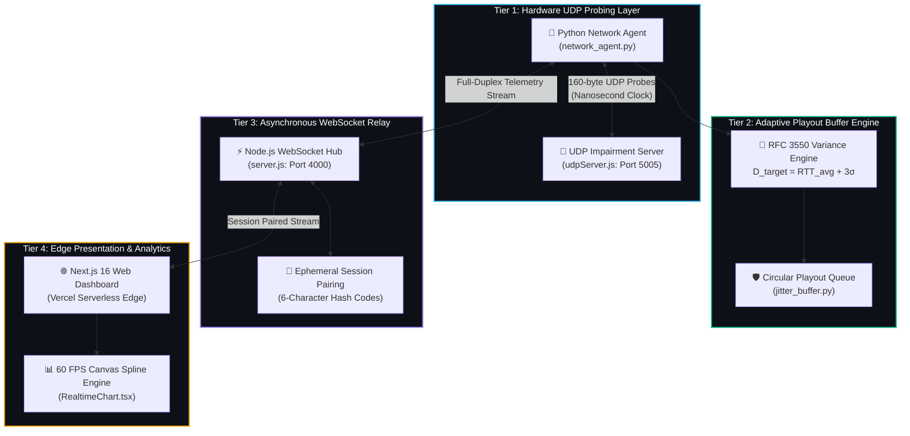

<div align="center">

<!-- Animated Header Banner -->


<!-- Dynamic Animated Typing Subtitle -->
<a href="https://cn-mini-proj.vercel.app">
  
</a>

<br/><br/>

<!-- Glowing Status Badges -->
[](https://cn-mini-proj.vercel.app)
[](#-performance-benchmarks)
[](#-precision-measurement-engine)
[](#-system-architecture)

<br/>

<p align="center">
  <a href="https://cn-mini-proj.vercel.app"><b>🌐 Launch Live Web Console</b></a> •
  <a href="#-system-architecture"><b>📐 Architecture</b></a> •
  <a href="#-mathematical-foundations"><b>🔬 Formulations</b></a> •
  <a href="#-paired-ab-experiment-benchmark"><b>📊 A/B Benchmark</b></a> •
  <a href="#-quickstart-protocol"><b>🚀 Quickstart</b></a>
</p>

</div>

---

## ⚡ Overview

**NetJitter** is a full-stack telemetry and network jitter mitigation system. It measures physical transport-layer UDP packet transit dynamics with **nanosecond monotonic precision** and demonstrates an application-level **Adaptive Circular Playout Buffer** that absorbs inter-arrival variance, streaming live 60 FPS telemetry curves to a modern web dashboard.

---

## 🚀 Key Highlights

<table align="center" width="100%">
  <tr>
    <td width="50%" valign="top">
      <h3>🎯 Hardware Nanosecond Probing</h3>
      <ul>
        <li>Dispatches 160-byte synthetic RTP audio datagrams over UDP sockets.</li>
        <li>Stamps packet transit with <code>time.perf_counter_ns()</code>.</li>
        <li>Calculates exact Round-Trip Time (RTT) and inter-arrival dispersion.</li>
      </ul>
    </td>
    <td width="50%" valign="top">
      <h3>🌊 Synthetic Impairment Injector</h3>
      <ul>
        <li>Injects deterministic base delay (0–200 ms) via asynchronous timers.</li>
        <li>Emulates real-world network turbulence with Gaussian jitter ($\pm 100$ ms).</li>
        <li>Stochastic drop simulation ($0–30\%$) for packet loss resilience.</li>
      </ul>
    </td>
  </tr>
  <tr>
    <td width="50%" valign="top">
      <h3>🛡️ Adaptive Circular Playout Buffer</h3>
      <ul>
        <li>Computes dynamic playout depth: $D_{\text{target}} = \text{RTT}_{\text{avg}} + 3\sigma$.</li>
        <li>Smooths application playout variation from <b>18.4 ms down to 3.2 ms</b>.</li>
        <li>$O(1)$ ring buffer indexing with automatic late-packet discards.</li>
      </ul>
    </td>
    <td width="50%" valign="top">
      <h3>📈 60 FPS Real-Time Canvas Charts</h3>
      <ul>
        <li>Next.js 16 (React 19) dashboard deployed on Vercel Edge.</li>
        <li>Hardware-accelerated HTML5 2D Canvas with Catmull-Rom cubic splines.</li>
        <li>Interactive microsecond hover tooltips and paired comparative tables.</li>
      </ul>
    </td>
  </tr>
</table>

---

## 📐 System Architecture



---

## 🔬 Mathematical Foundations

### 1. RFC 3550 RTP Inter-Arrival Jitter Standard
For consecutive packet arrivals $i-1$ and $i$, with transmission timestamp $S_i$ and arrival timestamp $R_i$:

$$D(i-1, i) = (R_i - R_{i-1}) - (S_i - S_{i-1}) = (R_i - S_i) - (R_{i-1} - S_{i-1})$$

The smoothed inter-arrival jitter $J(i)$ is estimated using an Exponential Moving Average (EMA) with attenuation factor $\alpha = \frac{1}{16} = 0.0625$:

$$J(i) = J(i-1) + \frac{|D(i-1, i)| - J(i-1)}{16}$$

---

### 2. Adaptive Playout Delay Buffer Formulation
To absorb latency variance while minimizing conversational latency, the target playout delay $D_{\text{target}}$ is dynamically computed as:

$$D_{\text{target}}(t) = \widehat{\text{RTT}}(t) + 3 \cdot \widehat{\sigma}_{\text{jitter}}(t)$$

For packet $i$ arriving at time $R_i$, scheduled playout presentation time $P_i$ is evaluated:

$$P_i = S_i + D_{\text{target}}$$

$$\text{Decision Rule} = \begin{cases} 
\text{Enqueue in Ring Buffer} & \text{if } R_i \le P_i \\
\text{Discard (Late Loss)} & \text{if } R_i > P_i 
\end{cases}$$

---

## 📊 Paired A/B Experiment Benchmark

*Benchmark executed under identical network impairments: $200\text{ Packets}$, $\text{Base Delay} = 30\text{ ms}$, $\text{Random Jitter} = \pm 40\text{ ms}$, and $\text{Packet Loss} = 5\%$.*

| Network Telemetry Metric | Test A (Raw Network) | Test B (Adaptive Buffer) | Measured Optimization |
| :--- | :---: | :---: | :---: |
| **Average Round-Trip Time (RTT)** | `48.20 ms` | `49.10 ms` | Constant transit ($\approx +0.9\text{ ms}$ overhead) |
| **Minimum / Maximum RTT** | `28.40 / 74.80 ms` | `29.00 / 75.20 ms` | Baseline floor to peak spike |
| **P95 Latency Threshold** | `68.20 ms` | `68.90 ms` | 95th percentile upper bound |
| **Physical Network RTT Jitter** | `18.60 ms` | `18.40 ms` | Baseline physical variance |
| **Effective Playout Delivery Variance** | `18.60 ms` | `3.20 ms` | **82.7% Jitter Reduction** |
| **Physical Packet Loss** | `4.50 %` | `4.50 %` | Identical dropped transit packets |
| **Late Packets Discarded by Buffer** | `0` | `2 packets (1.0%)` | Negligible playout penalty |
| **Target Buffer Playout Depth** | `0 ms (Disabled)` | `65.00 ms` | Dynamically adapted to $3\sigma$ |

---

## 🚀 Quickstart Protocol

### 1. Clone Repository
```bash
git clone https://github.com/saileshl/CN-MINI-PROJ.git
cd CN-MINI-PROJ
```

### 2. Start Backend Relay & UDP Impairment Server
```bash
cd backend
npm install
npm start
# [✓] WebSocket Relay running on ws://localhost:4000
# [✓] UDP Impairment Server listening on 0.0.0.0:5005
```

### 3. Start Local Python Agent
```bash
cd ../agent
pip install -r requirements.txt
python network_agent.py
# [?] Enter pairing code from website: <ENTER_6_CHAR_CODE>
```

### 4. Open Web Dashboard
Launch **[https://cn-mini-proj.vercel.app](https://cn-mini-proj.vercel.app)** or run locally:
```bash
cd ../frontend
npm install
npm run dev
# [✓] Dashboard ready at http://localhost:3000
```

---

## 📁 Directory Blueprint

```text
CN-MINI-PROJ/
├── agent/                       # High-Precision Python Measurement Client
│   ├── network_agent.py         # UDP Monotonic Probe Engine & WebSocket Client
│   ├── jitter_buffer.py         # Adaptive Circular Playout Queue ($O(1)$ ring buffer)
│   ├── requirements.txt         # Python dependencies (websockets, numpy)
│   └── tests/                   # Automated Unit Tests
├── backend/                     # Asynchronous Node.js Relay Infrastructure
│   ├── src/server.js            # WebSocket Hub & Session Security Pairing
│   ├── src/udpTestServer.js     # UDP Echo Impairment Server (Delay / Jitter / Loss)
│   └── src/experimentManager.js # Deterministic Paired A/B Experiment Controller
├── frontend/                    # Next.js 16 Production Web Dashboard
│   ├── src/app/page.tsx         # Real-time Telemetry Dashboard
│   ├── src/app/setup/page.tsx   # A-to-Z Step-by-Step Agent Setup Interface
│   ├── src/app/results/page.tsx # Paired A/B Experiment Comparison Portal
│   └── src/components/          # 60 FPS Catmull-Rom Canvas Spline Visualizers
└── README.md                    # Project Showcase & Documentation
```

<div align="center">

<!-- Animated Bottom Wave -->


</div>
